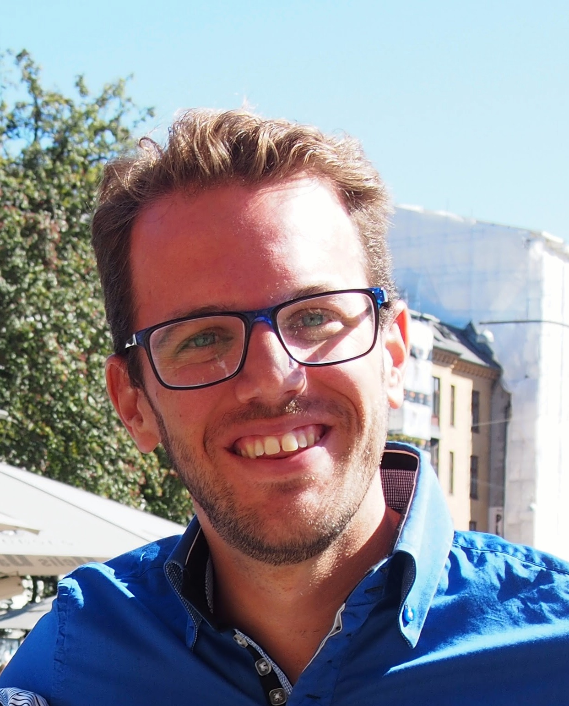

<!-- Load Font Awesome CSS -->
<link rel="stylesheet" href="https://cdnjs.cloudflare.com/ajax/libs/font-awesome/6.4.0/css/all.min.css">

# About me

<table>
  <tr>
    <td style="width: 200px; vertical-align: top;">
      
      

        🏳️‍🌈🔬🌍📖💻🚲♻️♟️
      

    </td>
    <td style="vertical-align: middle;">
      I am an Associate Professor at the Department of Electrical Engineering at the University of Málaga. Previously, I worked at the Department of Mathematical Sciences at the University of Copenhagen (2013–2016) and the Center for Electric Power and Energy at the Technical University of Denmark (2011–2013). I earned my Ph.D. in Electrical Engineering from the University of Castilla-La Mancha (Spain) in 2011, under the supervision of Prof. Antonio Conejo. My doctoral research, titled "Medium-term electricity trading for risk-averse power producers via stochastic programming," developed stochastic mathematical models to optimize the trading strategies of power producers in electricity derivatives markets. I also hold a B.Sc. and M.Sc. in Electrical Engineering from the University of Málaga, obtained in 2004 and 2006, respectively. My research focuses on power system operation and planning, decision-making under uncertainty, bilevel programming, machine learning, and statistics.
    </td>
  </tr>
</table>

# Contact

  <i class="fas fa-map-marker-alt contact-icon"></i> Edif. Ingenierías Office 2.085D, C/ Doctor Ortíz Ramos s/n, 29071, Málaga, Spain  
  <a href="https://maps.google.com/maps?ll=36.714982,-4.491975&z=16&t=m&hl=en-US&gl=US&mapclient=embed&daddr=UMA%3A%20Escuela%20T%C3%A9cnica%20Superior%20de%20Ingenier%C3%ADa%20Industrial%20Edificio%20de%20Ingenier%C3%ADas%2C%20UMA%20Campus%20de%20Teatinos%20C%2F%20Doctor%20Ortiz%20Ramos%2C%20S%2FN%2029071%20M%C3%A1laga%2C%20Spain@36.7154756,-4.4931618">Directions</a>

  <i class="fas fa-phone contact-icon"></i> 0034 ​951952357, 0034 681600943

  <i class="fas fa-envelope contact-icon"></i> <a href="mailto:spineda@uma.es">spineda@uma.es</a>

  <i class="fas fa-graduation-cap contact-icon"></i> <a href="https://scholar.google.com/citations?user=miAUG_cAAAAJ&hl=en">Google Scholar</a>

  <i class="fa-brands fa-orcid contact-icon"></i> <a href="https://orcid.org/0000-0002-1089-0970?lang=en">ORCID</a>

  <i class="fas fa-flask contact-icon"></i> <a href="https://www.researchgate.net/profile/Salvador-Pineda-3">ResearchGate</a>

  <i class="fas fa-chart-bar contact-icon"></i> <a href="https://www.scopus.com/authid/detail.uri?authorId=26649593600">Scopus</a>

  <i class="fab fa-github contact-icon"></i> <a href="https://github.com/salvapineda">GitHub</a>

  <i class="fab fa-linkedin contact-icon"></i> <a href="https://www.linkedin.com/in/spinedamorente">LinkedIn</a>

